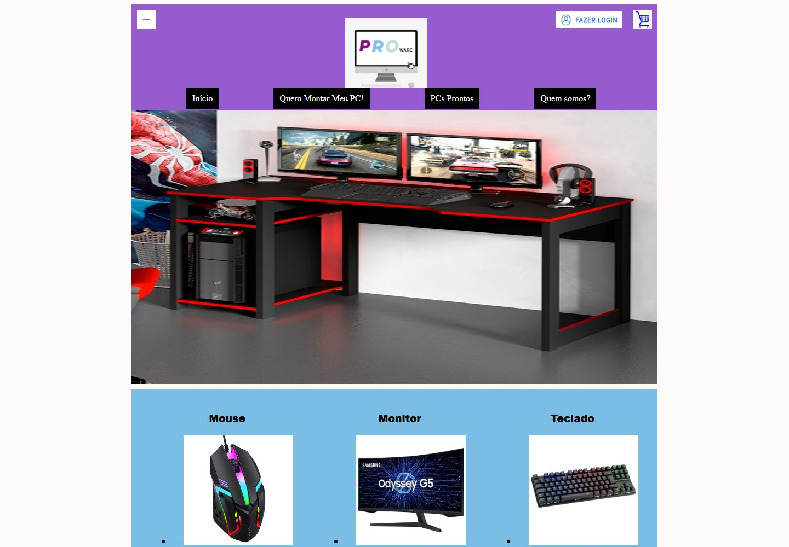
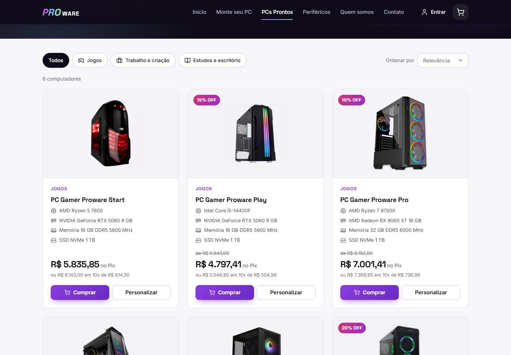
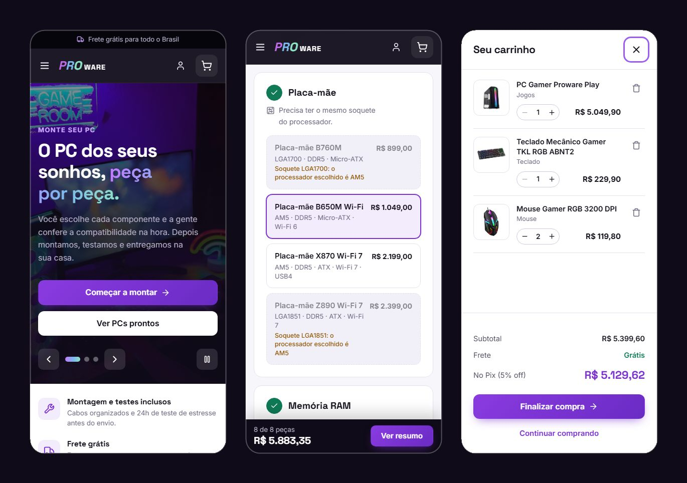
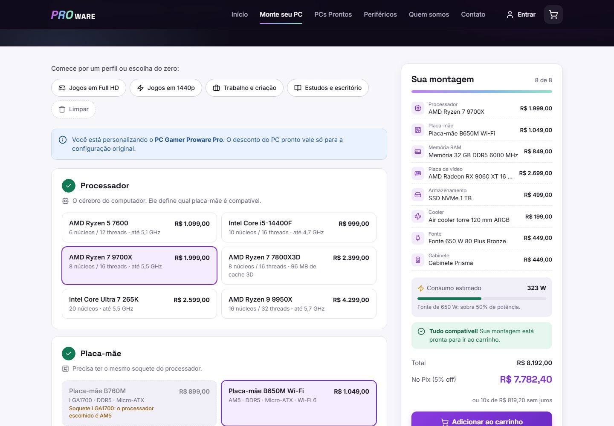
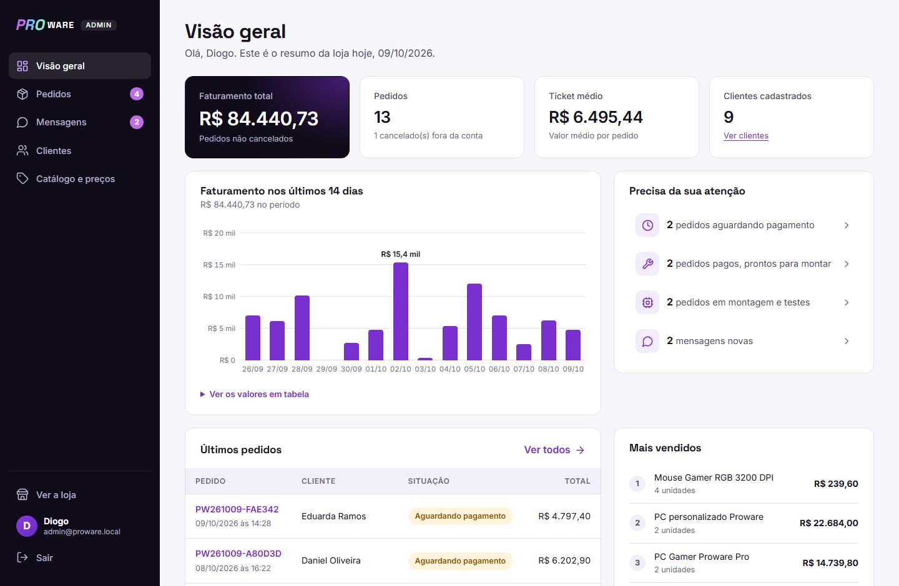
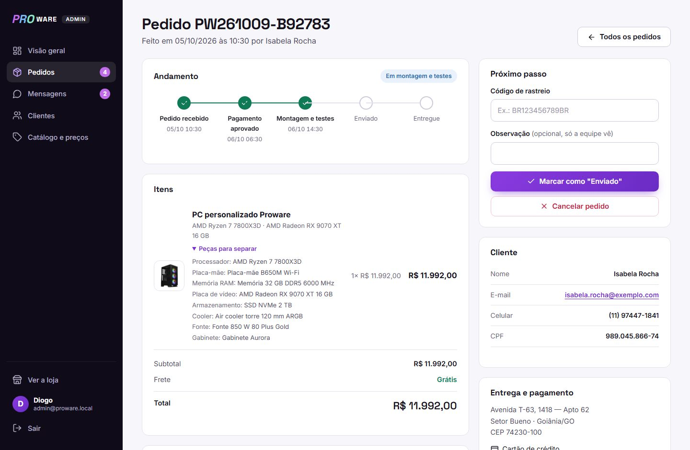
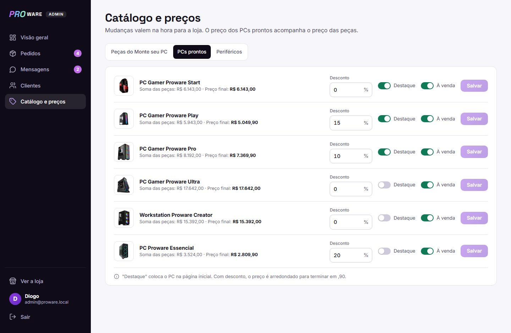

# Proware

[](https://github.com/diogoduo/Proware/actions/workflows/testes.yml)

Loja online de computadores onde você **monta o seu PC peça por peça**, com checagem de compatibilidade em tempo real, ou escolhe um PC pronto. Tem também um **painel administrativo** para acompanhar vendas, mudar a situação dos pedidos e alterar preços.

O projeto começou no ensino médio como um site estático de quatro páginas. Esta é a versão 2.0, refeita do zero **com as mesmas linguagens** (HTML, CSS, JavaScript e PHP), sem frameworks.


## Antes e depois

| Versão original (ensino médio) | Versão 2.0 |
| --- | --- |
|  |  |

O código original está preservado no primeiro commit do repositório.

## A loja

- **Monte seu PC**: escolha processador, placa-mãe, memória, placa de vídeo, armazenamento, cooler, fonte e gabinete. O configurador:
  - bloqueia peças incompatíveis e explica o motivo (soquete diferente, gabinete pequeno para a placa-mãe, processador sem vídeo integrado ou sem cooler na caixa);
  - calcula o consumo de energia e só libera fontes com folga;
  - remove sozinho uma peça que deixou de servir depois de uma troca, avisando o que mudou;
  - guarda a montagem no endereço da página, para compartilhar o link;
  - tem perfis prontos (jogos, trabalho, estudos) para começar.
- **PCs prontos** com filtro por uso e ordenação por preço. O preço de cada PC é a soma das peças, e o botão "Personalizar" abre o PC no configurador.
- **Periféricos** e **página de produto** com especificações técnicas.
- **Carrinho** em gaveta lateral, salvo no navegador e sincronizado entre abas.
- **Cadastro e login** com validação de CPF e máscaras de CPF, celular e CEP. O login bloqueia por 15 minutos depois de 5 senhas erradas.
- **Checkout** com endereço preenchido pelo CEP ([ViaCEP](https://viacep.com.br)), Pix com 5% de desconto, cartão em 10x ou boleto.
- **Minha conta**: histórico de pedidos com a data de cada etapa e o código de rastreio, além de edição de dados e troca de senha.
- **Contato** com formulário e perguntas frequentes.
- Layout responsivo, testado de 320 px (celular pequeno) até telas grandes.

<p align="center">
  
</p>



## O painel administrativo

Em `/admin/`, só para contas de administrador:

- **Visão geral**: faturamento, número de pedidos, ticket médio, gráfico de vendas dos últimos 14 dias (com os valores também em tabela), pendências e produtos mais vendidos.
- **Pedidos**: filtros por situação, busca por código, nome ou e-mail, e a página de cada pedido com as peças a separar. O pedido avança pelas etapas recebido → pago → montagem e testes → enviado (com código de rastreio obrigatório) → entregue, ou é cancelado. O cliente acompanha tudo na conta dele.
- **Mensagens** do formulário de contato, marcadas como novas, lidas ou respondidas.
- **Clientes**, com quantidade de pedidos e total gasto.
- **Catálogo e preços**: muda o preço e ativa ou desativa cada peça, define o desconto e o destaque dos PCs prontos e o preço dos periféricos. Como o preço de um PC é a soma das peças, alterar uma peça atualiza todos os PCs que a usam. Desativar uma peça tira esses PCs da vitrine.



| Pedido no painel | Catálogo e preços |
| --- | --- |
|  |  |

## Tecnologias

| Camada | Como foi feito |
| --- | --- |
| HTML | Semântico e acessível: navegação por teclado, `aria-*`, link "pular para o conteúdo" e `<dialog>` nativo no carrinho |
| CSS | Sem frameworks: variáveis CSS, Grid, Flexbox e `:has()`, em `estilo.css` (loja) e `admin.css` (painel) |
| JavaScript | Puro, sem jQuery: `app.js` (carrinho, carrossel, formulários), `montar.js` (configurador), `checkout.js` e `admin.js` (gráfico e edição do catálogo) |
| PHP | 8.1 ou superior, com banco **SQLite** via PDO: um único arquivo, sem precisar de servidor de banco de dados |

## Como rodar

Você precisa do **PHP 8.1 ou superior** com a extensão **pdo_sqlite** ativa. No `php.ini`, a linha `extension=pdo_sqlite` deve estar sem o `;` na frente. Se ela não estiver ativa, o site mostra uma mensagem explicando isso.

**Opção 1: servidor embutido do PHP**

```bash
php -S localhost:8000 router.php
```

Depois abra <http://localhost:8000>.

**Opção 2: XAMPP**

Copie a pasta do projeto para `C:\xampp\htdocs\proware`, inicie o Apache e abra <http://localhost/proware/>.

O banco (`app/storage/proware.sqlite`) é criado sozinho no primeiro acesso, já com o catálogo da loja.

### Criar um administrador

```bash
php ferramentas/admin.php criar "Seu Nome" seu@email.com
```

O comando mostra uma senha gerada (ou passe a sua como último argumento). Depois é só entrar pela página de login. Para dar acesso a uma conta que já existe, use `php ferramentas/admin.php promover email@exemplo.com`.

### Dados de demonstração

```bash
php ferramentas/demo.php
```

Cria 9 clientes fictícios, 14 pedidos em todas as situações e algumas mensagens, para o painel não começar vazio. Todos os clientes de demonstração usam a senha `demo12345`. Para recomeçar do zero, apague `app/storage/proware.sqlite`.

## Testes

```bash
php tests/executar.php
```

São 20 testes, sem dependências externas, num banco em memória. Eles cobrem as regras de compatibilidade, o recálculo dos preços do carrinho, a criação de contas e pedidos, o fluxo de situações do pedido, o bloqueio de login, a edição do catálogo e as métricas do painel. O [GitHub Actions](.github/workflows/testes.yml) roda os testes e a verificação de sintaxe em PHP 8.1, 8.2, 8.3 e 8.4 a cada envio.

## Estrutura

```
├── index.php, montar.php, pcs-prontos.php, ...   páginas da loja
├── admin/                    painel administrativo
├── app/
│   ├── bootstrap.php         sessão, cabeçalhos de segurança e constantes da loja
│   ├── banco.php             conexão SQLite, tabelas (migrations) e carga inicial
│   ├── catalogo.php          peças, PCs prontos, periféricos e regras de compatibilidade
│   ├── usuarios.php          contas, login, bloqueio por tentativas e acesso de admin
│   ├── pedidos.php           carrinho → pedido, situações e métricas do painel
│   ├── mensagens.php         formulário de contato
│   ├── dados/                catálogo inicial (copiado para o banco na primeira vez)
│   ├── views/                cabeçalho, rodapé e componentes da loja e do painel
│   └── storage/              banco de dados (ignorado pelo Git)
├── assets/                   css, js e imagens
├── ferramentas/              comandos de terminal (administradores e demonstração)
├── tests/                    testes automatizados
├── router.php                roteador para o `php -S`
└── .htaccess                 configuração para Apache
```

## Segurança

- Os preços **sempre** são recalculados no servidor: alterar o carrinho no navegador não muda o valor do pedido.
- A compatibilidade das peças é validada de novo no PHP antes de criar o pedido.
- Consultas ao banco sempre preparadas (sem risco de SQL injection) e dinheiro guardado em centavos.
- Senhas com `password_hash` e sessão renovada no login, com bloqueio temporário depois de várias senhas erradas.
- Token CSRF em todos os formulários, e sair da conta só por POST.
- Saídas escapadas com `htmlspecialchars` e Content Security Policy sem scripts nem estilos inline.
- O painel responde "página não encontrada" para quem não é administrador, e as pastas `app/`, `ferramentas/` e `tests/` ficam bloqueadas para acesso pelo navegador.

## Equipe

Bárbara Cziniel, Caio Caram, Diogo Duo, Eduardo Giovannini, Estela Maria, Gabriel Forte, Luan Fogaça e Maria Eduarda Sachi.

> Projeto de portfólio: a Proware não é uma loja real e nenhuma compra é cobrada.
